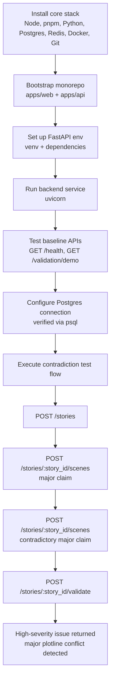

# inferStories

## Progress checkpoint: what is done so far

The current MVP foundation has been validated end-to-end with local services.

### Environment and tooling setup

- Node.js LTS, npm, and pnpm are installed.
- Python 3.11 virtual environment for backend is configured.
- Redis is installed and running (`PONG` health check).
- PostgreSQL connectivity is verified (via a Docker-backed instance in practice).
- Docker, Docker Compose, and Git are available.

### App bootstrap

- Frontend workspace created with Next.js (`apps/web`).
- Backend workspace created with FastAPI (`apps/api`).
- Backend dependencies installed:
  - `fastapi`, `uvicorn`, `pydantic`
  - `psycopg[binary]`, `sqlalchemy`, `alembic`
  - `redis`

### API proof-of-function

- Health endpoint tested:
  - `GET /health` -> `{"status":"ok"}`
- Demo validation endpoint tested:
  - `GET /validation/demo` -> sample validation issue payload
- Core contradiction flow tested:
  1. Create a story
  2. Add scene claims
  3. Add a contradictory scene claim
  4. Fetch validation and receive high-severity conflict for major plotline contradiction

### Workflow diagram

## Next implementation milestone

Wire the frontend to backend for a single-page workflow:

1. Create story
2. Add scene + claims
3. Display validation issues in real time
