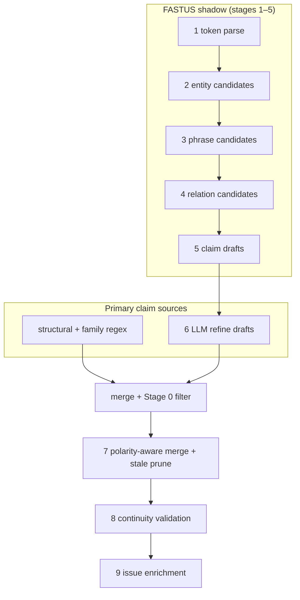
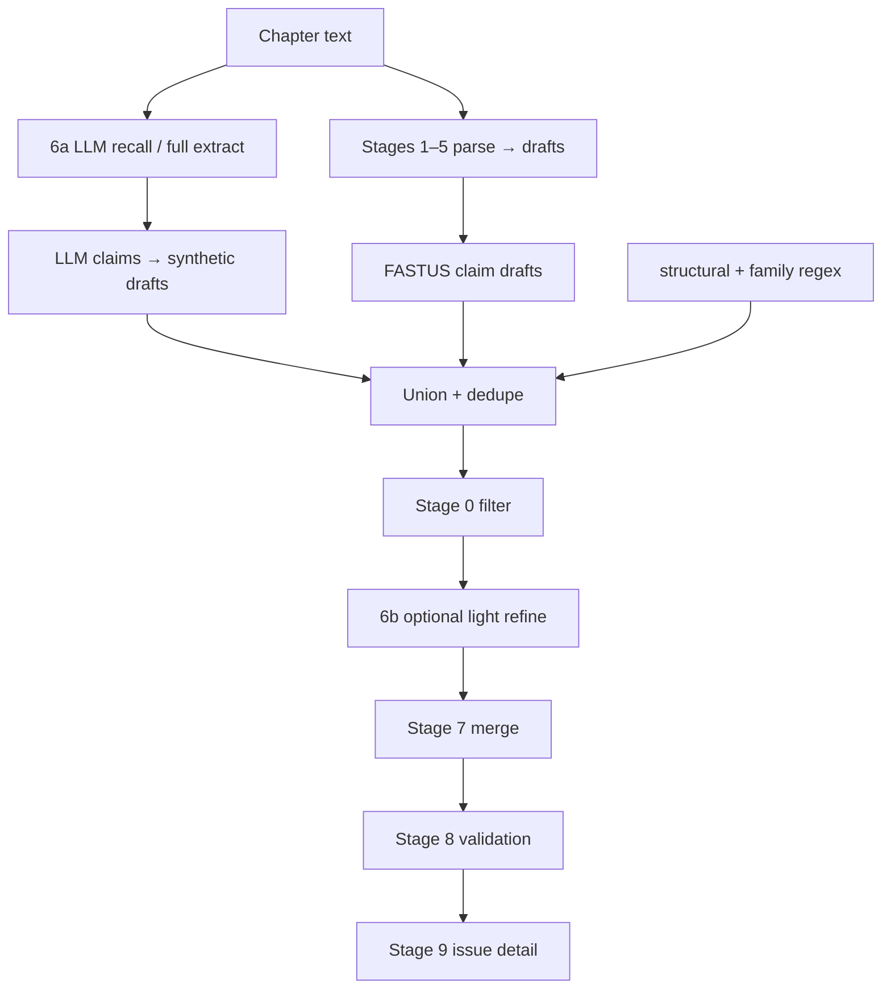
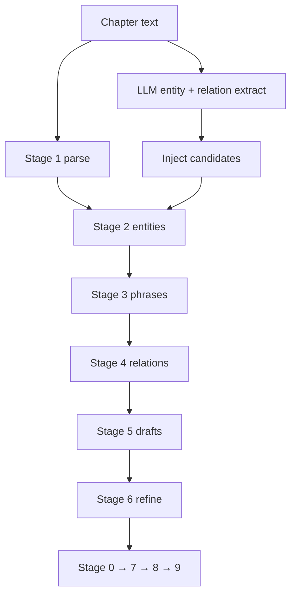

# LLM + FASTUS integration options

**Purpose:** Capture three concrete ways to combine OpenAI extraction with the FASTUS-inspired pipeline in inferStories, for second-opinion review before we pick a production direction.

**Audience:** Engineers and advisors evaluating recall vs. grounding, cost, and testability.

**Related docs:**

- [`FASTUS_ChatGPT.md`](./FASTUS_ChatGPT.md) — FASTUS stage mapping and target architecture (reference; do not edit for implementation tracking).
- [`README.md`](../README.md) — Current shipped behavior and dev setup.

**Last updated:** June 2026 (FASTUS stages 0–9; **Option B shipped** behind `FASTUS_LLM_FIRST=1`).

---

## 1. Current state (baseline)

Today, **Save & analyze memory** runs extraction per chapter chunk. Autosave does **not** run extraction.

| Layer | Role today |
|-------|------------|
| **Stages 1–5** | Parse prose, build entity/phrase/relation candidates and claim drafts. **Instrumented** (debug UI + optional console logs) but **do not replace** regex as the main extractor. |
| **Structural + family regex** | Primary deterministic extraction (trust/distrust, family relations, POV-aware patterns). |
| **Stage 6** | Refines Stage 5 drafts via LLM when drafts exist. If drafts are empty and `FASTUS_LLM_LEGACY=1`, falls back to **full-chunk LLM extract**. |
| **Stage 0** | Fragment rejection, negation/polarity safety on all claims before persist. |
| **Stages 7–9** | Merge with story canon, prune stale claims on re-save, polarity-aware validation, enriched issue detail. |

### Env flags (today)

| Variable | Effect |
|----------|--------|
| `FASTUS_DEBUG=1` | Stage BEGIN/COMPLETE/SKIP lines on API stderr; structured events always in Extraction details UI. |
| `FASTUS_LLM_LEGACY=1` | When Stage 5 produces zero drafts, Stage 6 runs legacy full-chunk OpenAI extract instead of skipping. |
| `OPENAI_API_KEY` | Required for LLM refine/legacy; without it, drafts passthrough or heuristics apply. |

### Known gap

Recall is still limited when **both** regex and FASTUS 1–5 produce few drafts. `FASTUS_LLM_LEGACY` only helps when drafts = 0, not when drafts are **sparse but incomplete**.

---

## 2. Option A — LLM first, FASTUS downstream only

**Idea:** Run full LLM extraction first. Use FASTUS only for merge, polarity filter, continuity validation, and issue enrichment — **skip** stages 1–5 for claim production.

### How it would work

1. Chunk chapter text (unchanged).
2. **Always** call OpenAI full-chunk extract (today’s `_openai_extract_chunk` / legacy path).
3. Skip or demote structural regex and FASTUS 1–5 for **output** (keep optional shadow metrics).
4. Run Stage 0 → 7 → 8 → 9 as today.

### Pros

- **Maximum recall** — model sees full passage without depending on regex/parse misses.
- **Simplest mental model** — one extractor, one merge path.
- **Closest to current `FASTUS_LLM_LEGACY=1`** when drafts are empty; extend to always-on.

### Cons

- **Weak grounding** — claims may lack reliable text offsets and evidence anchors; continuity checks depend on quotes the model chose, not deterministic spans.
- **Hallucination risk** — no deterministic candidate gate before the LLM; harder to regression-test per chapter.
- **Contradicts FASTUS philosophy** — “send chapter to GPT and hope” vs. deterministic-first pipeline (see `FASTUS_ChatGPT.md`).
- **Loses negation/polarity signals** from parse layers unless Stage 0 heuristics catch them post hoc.

### When to choose

- Prototype / author-facing beta where **recall matters more than auditability**.
- Short term if we need a **single env flag** (`FASTUS_LLM_FIRST=1` alias of always legacy) before building Option B.

### Cost

~1 LLM call per chunk (same as legacy today when drafts = 0).

---

## 3. Option B — LLM first, FASTUS grounds and augments (recommended)

**Idea:** LLM runs **first** for **recall** (propose claims). FASTUS 1–5 still run on the **original passage** to **ground**, verify evidence, add polarity, and capture facts the LLM missed. Union + dedupe before persist.

### How it would work

1. **Stage 6a (new):** Full LLM extract per chunk → `ExtractedClaim` list (or map to `ClaimDraft` with evidence).
2. **Stages 1–5 (unchanged):** Parse same chunk text; produce drafts and debug events.
3. **Regex layer (unchanged):** Structural + family patterns.
4. **Grounding pass (new logic):**
   - For each LLM claim, verify `evidence` / `claim_text` appears in chunk (`claim_anchored_in_scene` pattern from stale-prune work).
   - Drop or downgrade unanchored LLM claims.
   - FASTUS drafts that duplicate LLM claims keep deterministic evidence offsets.
5. **Union** LLM + FASTUS + regex; Stage 0 filter; optional **6b** refine only on ambiguous combined set (or skip second call).
6. Stages 7–9 unchanged.

### Pros

- **High recall** from LLM **plus** deterministic safety net.
- **Evidence anchoring** — FASTUS parse and regex still tie facts to passage spans.
- **Testable** — golden chapters can assert on regex/FASTUS paths independently of LLM.
- **Fits FASTUS spirit** — LLM **proposes**, deterministic layer **adjudicates** (Jurafsky: IE pipeline with learned + rule stages).

### Cons

- **More engineering** — union rules, anchor verification, dedupe across three sources.
- **Cost** — 1 LLM call per chunk minimum; optional second refine call if 6b enabled.
- **Latency** — LLM-first adds wall-clock before parse (can run LLM ∥ parse per chunk if desired).

### Env (implemented)

| Variable | Effect |
|----------|--------|
| `FASTUS_LLM_FIRST=1` | Enable Stage 6a LLM recall; parallel with FASTUS 1–5 + regex; union + dedupe. |
| `FASTUS_LLM_REFINE=0` | Skip Stage 6 refine when using LLM-first (default pairing). |
| `FASTUS_STRICT_ANCHORING=0` | Unanchored recall → `needs_review`; `1` drops unanchored recall. |
| `FASTUS_LLM_CACHE_DIR=...` | Disk cache for recall (`recall_{hash}.json`) and refine. |

**Code:** `app/extraction/llm_recall.py`, `evidence_anchor.py`, `source_dedupe.py`; wired in `extract.py`.

### When to choose

- **Production direction** when authors report missing story-shaping claims but we must keep continuity trustworthy.
- Aligns with discussed **“Stage 10”** as recall/gap-fill, but ordered **before** merge instead of only after sparse drafts.

### Cost

1–2 LLM calls per chunk (1 if refine skipped).

---

## 4. Option C — LLM seeds FASTUS candidates (middle ground)

**Idea:** LLM does **not** emit final claims first. It emits **structured candidates** (entities + relation triples + optional evidence). Those inject into Stages 2–4 as synthetic `EntityCandidate` / `RelationCandidate` inputs. Stages 5–6 map and refine as today.

### How it would work

1. New prompt/schema: JSON array of `{ subject, predicate, object, evidence, polarity?, claim_type? }` — **triples**, not finished claim sentences.
2. Map triples → `RelationCandidate` (origin=`llm_seed`) with confidence from model.
3. Optionally map subject/object strings → `EntityCandidate` (origin=`llm_seed`).
4. Stages 5–6 merge LLM-seeded relations with spaCy/regex relations; single refine pass.
5. Structural/family regex remain parallel safety net.

### Pros

- **One coherent FASTUS pipeline** — LLM is another **candidate producer**, like spaCy NER, not a parallel universe.
- **Better for relation recall** — “my mom” → `Renée mother_of Bella` without hand-authored family regex for every phrasing.
- **Single Stage 6 refine** — same contract as today (refine drafts, don’t invent from scratch in refine prompt… though seeds may need relax “do not invent” for net-new candidates from LLM seed pass).

### Cons

- **New prompt + mapping code** — entity typing, POV, polarity must map cleanly into existing types.
- **Recall ceiling** — still bounded by what triple prompt elicits; may miss complex `character_state` / `world_rule` claims unless schema expands.
- **Refine prompt tension** — current Stage 6 says “do not invent new candidates”; LLM seed pass must be explicitly allowed to add candidates Stage 5 didn’t derive from parse-only relations.

### Proposed env

| Variable | Effect |
|----------|--------|
| `FASTUS_LLM_SEED=1` | Run LLM triple extract and inject into stages 2–4. |

### When to choose

- We want to **promote FASTUS 1–6 to primary** and demote raw regex over time.
- Team prefers **one refinement step** over Option B’s union of three claim lists.

### Cost

~1 LLM call per chunk (seed) + 1 refine call when drafts non-empty.

---

## 5. Comparison matrix

| Criterion | A: LLM downstream only | B: LLM first + FASTUS ground | C: LLM seed candidates |
|-----------|--------------------------|------------------------------|-------------------------|
| **Recall** | High | High | Medium–high |
| **Evidence anchoring** | Low | High | Medium–high |
| **Testability / golden tests** | Low | High | High |
| **Implementation effort** | Low (flag extension) | Medium–high | Medium |
| **LLM calls / chunk** | 1 | 1–2 | 1–2 |
| **FASTUS 1–5 role** | Optional shadow | Required grounding | Primary path + seeds |
| **Hallucination risk** | Highest | Lower | Medium |
| **Aligns with FASTUS doc** | Weak | Strong | Strong |

---

## 6. What we should **not** do

**Do not** feed LLM JSON **into** stages 1–4 instead of the chapter text. Stages 1–4 are linguistic parsers over **prose** (tokens, deps, NER). They require the source passage.

**Do not** remove Stage 0 polarity/fragment filter regardless of option — it is the last deterministic safety gate before canon merge.

---

## 7. Recommendation (for discussion)

| Priority | Suggestion |
|----------|------------|
| **Near term** | Ship **Option B** behind `FASTUS_LLM_FIRST=1` for authors who need recall; keep default path as today for stability. |
| **Parallel** | Keep improving FASTUS 1–5 **shadow → primary** promotion (Option C direction) so LLM seeds become less necessary over time. |
| **Avoid as default** | Option A as the only path — useful as fallback flag, not production default. |

### Open questions for second opinions

1. **Is one LLM call per chunk acceptable** at manuscript scale (cost/latency), or should recall run only when FASTUS draft count &lt; threshold?
2. **Should unanchored LLM claims be dropped** (strict) or kept as `needs_review` (permissive)?
3. **Option B vs C:** Is union-of-claims (B) simpler to reason about than candidate injection (C) for continuity debugging?
4. **When to retire `FASTUS_LLM_LEGACY`:** Subsumed by `FASTUS_LLM_FIRST` or kept for drafts=0-only fallback?
5. **Promotion path:** At what draft-coverage metric do we flip default from regex-primary to FASTUS-primary?

---

## 8. Book pointers

- **Jurafsky & Martin — *Speech and Language Processing*:** Information extraction pipelines (candidate generation → filtering → merging); relation extraction; evaluation of recall/precision tradeoffs.
- **DDIA Ch. 3 — Storage and Retrieval:** Caching LLM refine results (`FASTUS_LLM_CACHE_DIR`); derived data (validation issues) invalidation on re-extract.
- **AIMA — knowledge representation:** Treating accepted claims as story facts; reasoning over explicit predicates and polarity; separation of belief vs. canon.

---

## 9. Implementation checklist (when a option is chosen)

- [ ] Env flag + debug lifecycle events for new stage(s)
- [ ] Golden chapter tests (Twilight Ch. 13 regression suite)
- [ ] Anchor verification for LLM claims (reuse `claim_anchored_in_scene`)
- [ ] Dedupe matrix: LLM vs FASTUS draft vs structural (existing `layer_dedupe`)
- [ ] Update `env.example` and README
- [ ] Extraction debug UI: show source origin (`llm_first`, `fastus_draft`, `regex`)
- [ ] Document cost model (tokens/chapter) in ops notes
